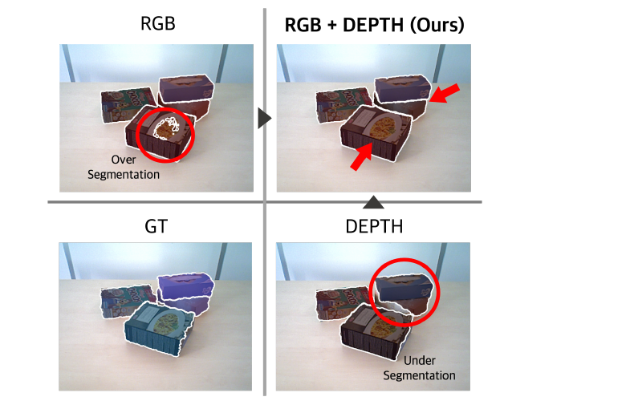
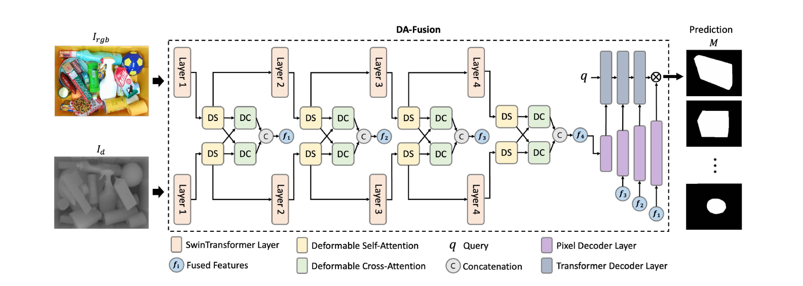

<div align="center">

# DA-Fusion: Deformable Attention-based RGB-D Fusion Transformer for Unseen Object Instance Segmentation

**Yesol Park**<sup>1\*</sup> · **Hye-Jung Yoon**<sup>1\*</sup> · **Juno Kim**<sup>1\*</sup> · **Byoung-Tak Zhang**<sup>1,2,3</sup>

<sup>1</sup>Interdisciplinary Program in AI, Seoul National University · <sup>2</sup>AI Institute, SNU · <sup>3</sup>Dept. of Computer Science, SNU
<br><sub>\*Equal contribution</sub>

**IEEE ICRA 2025**

<a href="https://ieeexplore.ieee.org/document/11128151"></a>&nbsp;
<a href="https://arxiv.org/abs/2607.17754"></a>&nbsp;
<a href="https://github.com/teamROBI/DA-Fusion"></a>&nbsp;
<a href="LICENSE"></a>&nbsp;




</div>

> **TL;DR:** DA-Fusion fuses RGB and depth at every backbone stage with deformable self- and
> cross-attention, combining texture and geometry to segment unseen objects in cluttered scenes —
> reducing the over-segmentation of RGB-only methods and the under-segmentation of depth-only ones.

## Abstract

In logistics automation, precise segmentation of unseen objects is crucial for efficient robotic
manipulation in cluttered environments. Tasks such as bin-picking and shelf-picking require robust
perception to handle occlusions, varying object shapes, and complex spatial arrangements.
Traditional RGB-based methods tend to over-segment objects due to their reliance on texture, while
depth-based methods often under-segment by focusing primarily on geometric features. To address
these limitations, we propose **DA-Fusion**, a deformable attention-based RGB-D fusion Transformer
designed for unseen object instance segmentation. DA-Fusion effectively combines the strengths of
both RGB and depth data, enhancing segmentation accuracy in cluttered and multi-layered object
environments. We also introduce the **Object Clutter Bin Dataset (OCBD)**, a benchmark dataset
specifically tailored for evaluating bin-picking scenarios in top-down views. Extensive evaluations
demonstrate that DA-Fusion outperforms state-of-the-art methods across diverse environments, making
it particularly suited for real-world logistics tasks.

## Method



DA-Fusion extracts features from the RGB and depth inputs through two parallel Swin Transformer
branches and fuses them at every stage using a deformable attention mechanism: **Deformable
Self-Attention (DS)** refines each modality's features, and **Deformable Cross-Attention (DC)**
exchanges information across modalities. The multi-scale fused features are decoded by a Mask
Transformer decoder to produce class-agnostic instance masks. This dynamic, multi-level fusion
integrates texture and geometry to reduce both the over-segmentation of RGB-only models and the
under-segmentation of depth-only models.

## Contents
- [Installation](#installation)
- [Data](#data)
- [Usage](#usage)
- [Results](#results)
- [Repository layout](#repository-layout)
- [Citation](#citation)
- [Acknowledgements](#acknowledgements)
- [License](#license)

## Installation

Setup uses [uv](https://docs.astral.sh/uv/) with Python 3.10 (PyTorch 2.4 / CUDA 12.4, with
Detectron2 built from source). The full environment is scripted:

```bash
bash dafusion/scripts/setup_env.sh      # creates dafusion/.venv
```

This installs `torch==2.4.1` + `torchvision==0.19.1` (cu124), Detectron2 (editable, from a source
clone), the DA-Fusion package, and the deformable-attention CUDA op. Place the Swin-L COCO
initialization checkpoint under `data/checkpoints/mask2former/`.

## Data

DA-Fusion is trained on **UOAIS-Sim** and evaluated on **OCID**, **OSD**, and our **OCBD**.
Datasets live under `data/UOIS/` (a symlink; `data/` is not tracked by git):

```
data/UOIS/
├── UOAIS-Sim/          # training — tabletop + bin scenes, COCO-style annotations
├── OCID-dataset/       # evaluation
├── OSD-0.20-depth/     # evaluation
└── OCBD/               # evaluation (ours)
```

## Usage

Run from the repository root.

Training is two stages: a main run, then a second cosine cycle continuing from it.

```bash
# Stage 1 -- main training run on UOAIS-Sim (RGB-D, Swin-L), 450k samples
CONFIG=configs/dafusion_rgbd_uoais_stage1.yaml NUM_GPUS=4 bash dafusion/scripts/train.sh \
  SOLVER.IMS_PER_BATCH 20 SOLVER.MAX_ITER 22500 SOLVER.WARMUP_ITERS 1000 \
  SOLVER.CHECKPOINT_PERIOD 3000

# Stage 2 -- second cosine cycle from the stage-1 checkpoint, 150k samples
CONFIG=configs/dafusion_rgbd_uoais_stage2.yaml NUM_GPUS=4 bash dafusion/scripts/train.sh \
  SOLVER.IMS_PER_BATCH 20 SOLVER.MAX_ITER 7500 SOLVER.WARMUP_ITERS 200 \
  SOLVER.CHECKPOINT_PERIOD 1500
```

Evaluation. `DAFUSION_KEEP_SOFT_MASKS=1` is required by the post-processing config, which is
selected with `DAFUSION_POSTPROC_V2`; OCID additionally uses `DAFUSION_CROP_TO_VALID=1` and OCBD
`DAFUSION_ALIGN_DEPTH=1`.

```bash
cd dafusion

# OSD / OCBD
DAFUSION_KEEP_SOFT_MASKS=1 DAFUSION_POSTPROC_V2=configs/postproc/postproc.json \
  python -m dafusion.eval.benchmark --dataset osd \
  --config configs/dafusion_rgbd_uoais_stage2.yaml --weights <path/to/model.pth> \
  --input_type rgbd --fg_filter depth

DAFUSION_KEEP_SOFT_MASKS=1 DAFUSION_ALIGN_DEPTH=1 \
  DAFUSION_POSTPROC_V2=configs/postproc/postproc.json \
  python -m dafusion.eval.benchmark --dataset ocbd \
  --config configs/dafusion_rgbd_uoais_stage2.yaml --weights <path/to/model.pth> \
  --input_type rgbd --fg_filter depth

# OCID
DAFUSION_KEEP_SOFT_MASKS=1 DAFUSION_CROP_TO_VALID=1 \
  DAFUSION_POSTPROC_V2=configs/postproc/postproc_ocid.json \
  python -m dafusion.eval.benchmark --dataset ocid \
  --config configs/dafusion_rgbd_uoais_stage2.yaml --weights <path/to/model.pth> \
  --input_type rgbd --fg_filter depth
```

## Results

DA-Fusion is evaluated with Overlap and Boundary Precision / Recall / F-measure and the percentage
of segments with Overlap F ≥ 75% (F@75).

| Benchmark | Overlap P | Overlap R | Overlap F | Boundary F | F@75 |
|:--|:--:|:--:|:--:|:--:|:--:|
| OCID | 93.2 | 92.6 | **92.1** | 90.0 | 92.7 |
| OSD  | 93.5 | 92.4 | **92.9** | 88.0 | 92.9 |
| OCBD | 92.5 | 90.4 | **91.3** | 88.7 | 87.1 |

> Reproduced numbers may deviate slightly from the paper due to GPU type and inherent randomness
> in training.

## Repository layout

```
dafusion/
├── dafusion/          # package: modeling (dual-Swin + DS/DC fusion), data, engine, eval
├── configs/           # training / evaluation configs (Swin-L, RGB-D)
├── scripts/           # setup / train / eval entry points
└── third_party/       # Detectron2 (built from source)
docs/                  # paper figures + PDF
data ->                # datasets & checkpoints (symlink; not tracked)
```

## Citation

If you find this work useful, please cite:

```bibtex
@inproceedings{park2025dafusion,
  title     = {DA-Fusion: Deformable Attention-based RGB-D Fusion Transformer for Unseen Object Instance Segmentation},
  author    = {Park, Yesol and Yoon, Hye-Jung and Kim, Juno and Zhang, Byoung-Tak},
  booktitle = {IEEE International Conference on Robotics and Automation (ICRA)},
  year      = {2025}
}
```

## Acknowledgements

DA-Fusion builds on [Mask2Former](https://github.com/facebookresearch/Mask2Former),
[Detectron2](https://github.com/facebookresearch/detectron2),
[Swin Transformer](https://github.com/microsoft/Swin-Transformer),
[Deformable Attention (DAT)](https://github.com/LeapLabTHU/DAT), and the
[UOAIS](https://github.com/gist-ailab/uoais) benchmark suite. We thank the authors for releasing
their code and datasets.

## License

Released under the [MIT License](LICENSE). Vendored third-party components remain under their
respective licenses.
